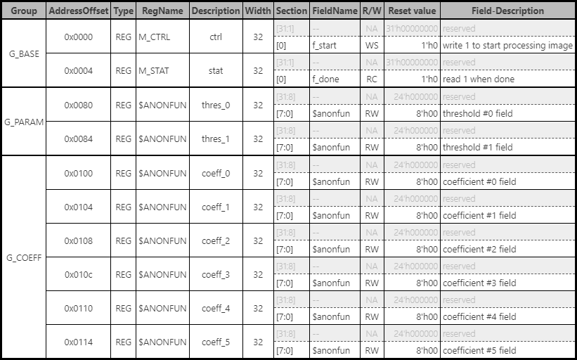

# FPGACompet.AxiLite

FPGA竞赛的IP配置模块代码，基于SpinalHDL 1.10.2a，使用[SpinalTemplateSbt](https://github.com/SpinalHDL/SpinalTemplateSbt)作为模板进行构建。

## 架构介绍

模块内部使用了类似NVDLA的CSB总线进行寄存器的配置，并通过AxiLite2CSB模块适配AxiLite4总线的接口。

寄存器排布如下图所示。

## 代码组织

- `hw/spinal`: 设计源码
    - `lib/adaptor`: AxiLite4转配置空间总线（Config Space Bus, CSB）的适配器
    - `lib/bus/csb`: CSB总线的实现
    - `lib/bus/regif`: CSB 从端寄存器接口实现，基于SpinalHDL 1.10.2a的BusIf抽象类
    - `axi_lite_regs`: 顶层模块、仿真及项目配置代码
- `hw/gen`: 生成的Verilog源文件、C语言头文件及寄存器配置表格网页文件

## 快速开始

### 生成Verilog

1. 安装sbt及make
2. 生成Verilog及其他相关文件：`make gen`

### 仿真

`make sim`

### 查看仿真波形

`make wave`
